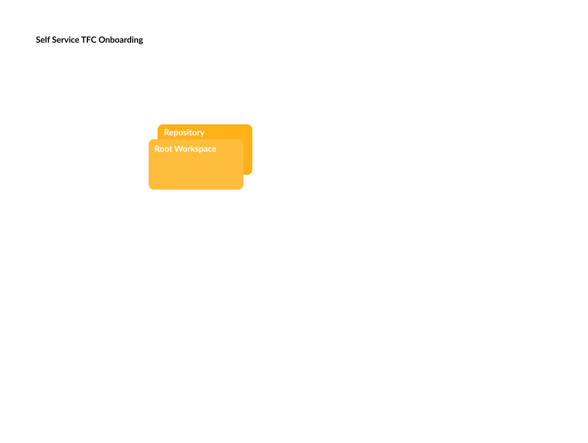
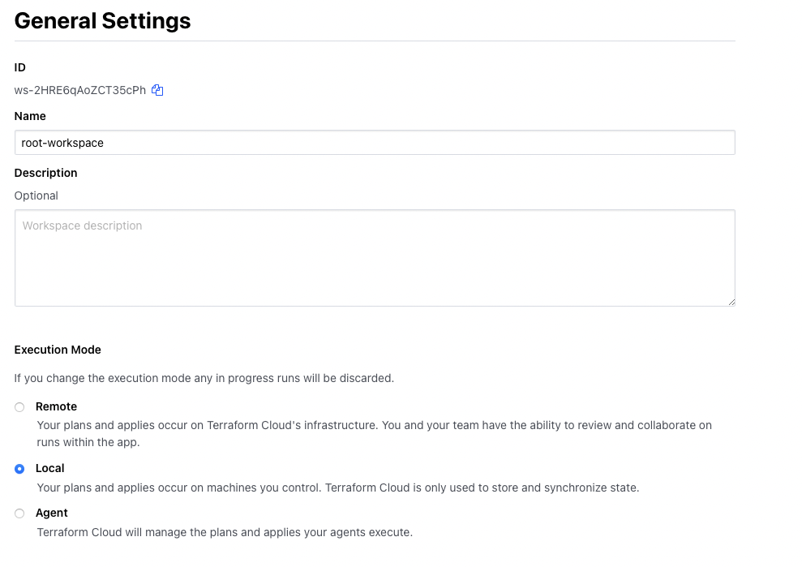
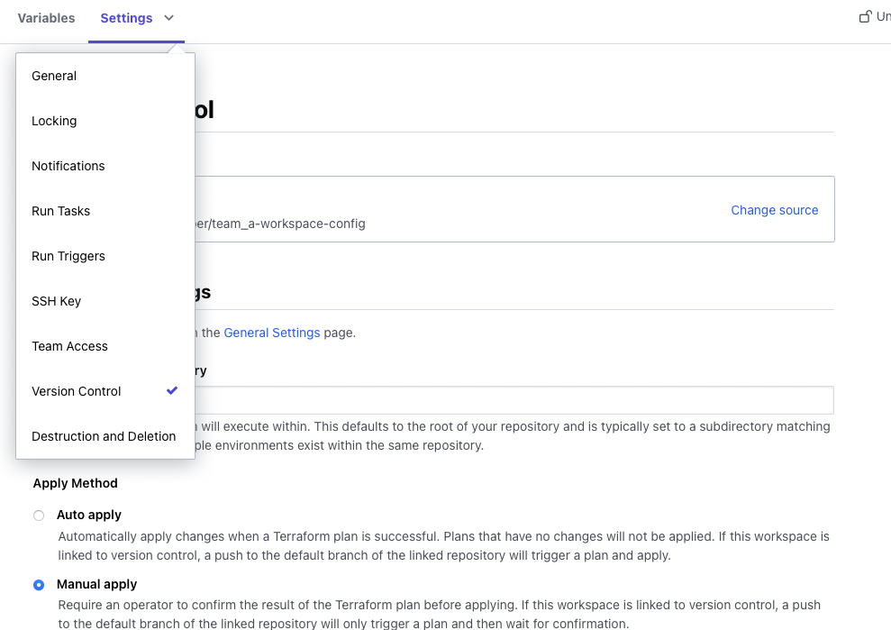
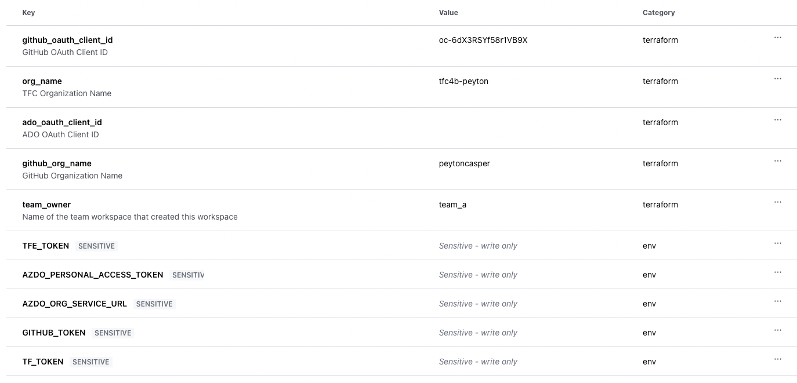
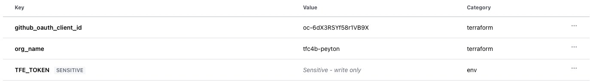

<h1 align="center">Terraform Cloud Onboarding</h1>

<p align="center">
    
</p>

## What is this and Why?

Onboarding effectively, is an incredibly challenging problem, beacuse it usually involes multiple stake holders with different levels of familiarity with the tool. This usually results in people treating platforms like services in which the owner attempts to do everything for everyone. This inevitably leads to frustration on all sides as the queue of work gets longer and longer. This repository and accompanying blog post provide example modules and sentinel policies for providing a self service onboarding process within Terraform Cloud.

## Repo Breakdown

`root-workspace` - Contains a team workspace module which would ideally be uploaded to the Private Module registry, but is bundled with this repo for simplicity. Implementing this module as is done in the main.tf would create a workspace within TFC and a accompanying GitHub repository. This repository would serve as the foundation for the next directory.

`team-workspace` - Contains an application workspace module which is similar to the team module, but inherits its team ownership from the `team_owner` variable which gets passed in.

`sentinel` - Contains three policies 

1. `restrict-non-module-resources.sentinel` - Deny any resource that is not defined in the root module
2. `restrict-team-modules.sentinel` - Deny any module that isn't in the approved list
3. `team-owner-change.sentinel` - Prevent a run from happening if the team_owner variable differs from the team data source

`policy_sets` - Builds a matrix of workspaces based on their tags and applies sentinel policy sets based on the workspace tag

## Quick Note

This example, is focused on using CLI driven runs for simplicity. In production, you want to leverage VCS driven runs or a pipeline to trigger Terraform Cloud

## Setup

These repositories support both GitHub and ADO repository creation. Set one or the other.

### TFC Environment Variables

```
TFE_TOKEN=""
```

### GitHub Environment Variables

```
GITHUB_TOKEN=""
```

### Azure Environment Variables

```
AZDO_ORG_SERVICE_URL=""
AZDO_PERSONAL_ACCESS_TOKEN=""
```

### Attach your VCS to TFC

https://www.terraform.io/cloud-docs/vcs#configuring-vcs-access

## Configure the Root Workspace

1. Manually create a workspace in your TFC organization
2. Create a backend.tf file in the `root-workspace` directory

```
terraform {
  backend "remote" {
    hostname = "app.terraform.io"
    organization = "tfc4b-peyton"

    workspaces {
      name = "root-workspace"
    }
  }
}
```

3. Configure the `team_workspace` module. Feel free to replace the module source below with the local copy if you want to get up and running faster

```
module "team_a" {
    source  = "app.terraform.io/tfc4b-peyton/team-onboarding-module/tfe"
    version = "1.0.1"
    # source = "./team_workspace_module"
    org_name = var.org_name
    team_name = "team_a"

    use_github = true
    github_org_name = var.github_org_name
    github_oauth_client_id = var.github_oauth_client_id
}
```

4. Set your workspace execution to local mode




5. Configure the terraform.tfvars file

```
github_oauth_client_id=""
org_name=""
github_org_name=""
```

6. Run terraform apply

```
terraform apply
```

## Configure the Team Workspace

1. Create a backend.tf file in the `team-workspace` directory for the team workspace that was just created

```
terraform {
  backend "remote" {
    hostname = "app.terraform.io"
    organization = "tfc4b-peyton"

    workspaces {
      name = "team_a-workspace"
    }
  }
}
```

2. Configure the `app_workspace` module. Feel free to replace the module source below with the local copy if you want to get up and running faster

```
module "web" {
    source  = "app.terraform.io/tfc4b-peyton/app-onboarding-module/tfe"
    version = "1.0.2"
    # source = "./app_workspace_module"
    team_name = var.team_owner
    app_name = "web"
    use_github = true
    org_name = var.org_name
    github_org_name = var.github_org_name
    github_oauth_client_id = var.github_oauth_client_id
}
```

3. Remove the VCS configuration from the team workspace



4. Set your environment variables in the UI, notice that our previous step auto created a lot of your Terraform Varibles.



5. Run terraform apply

```
terraform apply
```

## Create Policy Sets

1. Manually create a workspace in your TFC organization

2. Create a backend.tf file in the `policy-sets` directory for the team workspace that was just created

```
terraform {
  backend "remote" {
    hostname = "app.terraform.io"
    organization = "tfc4b-peyton"

    workspaces {
      name = "policy-sets"
    }
  }
}
```

3. Set the `policy-sets` workspace variables



4. Run terraform apply

```
terraform apply
```